## Contrastive Vision Learning
The Contrastive Vision Encoder takes in a image and converts into a series of embeddings, so there will be one for each of the block of pixels[grid] in the given image. This embedding is a vector of a fixed size which will be concatinated with the tokens embeddings.

The Transformer Decoder receieves the collection of the image embeddings and the tokens embeddings. The transformer decoder will attend to the image tokens as a condition to generate the text.

This is visual representation of the above text.

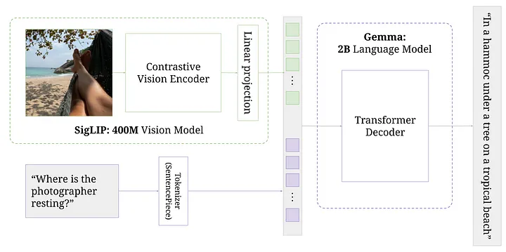

**What is Contrastive Learning?**

Here we have 2 Encoders, one for texts and one for the images. Both of these makes embeddings for the given individual data respectively. 

**Embeddings** is a vector that captures most of the information for the given data(image and text).

> [!NOTE]
> With Contrastive Learning we want the dot product of the image embedding with the corresponding text embedding to be the highest and it will be the lower when u do the dot 
> product with not the correspoinding text embedding.

So in **Contrastive Learning** what we do is we take a list of images and list of text which is corresponding text for each of the images, we encode them into list of embeddings and then train this model the **Text Encoder** and the **Image Encoder** to produce embeddings in such a way that when the dot product of the image with its corresponding text produces a higher value and when done with other non corresponding text it produces a lower value.

We then want to find a **Loss Function** that forces the dot products to be high forming a diagonal and all others to be low. For this we use the **Cross Entropy Loss**.

## How Language Models are trained?

Language Models are trained using the **Next token Prediciton task**.

We give the language model a prompt and it produces a series of embeddings which are then converted into **logits**. **Logits** is a distribution, vector which tells us what score the language model has assigned to what the next token should be among all the tokens in the vocabulary.

The **Cross Entropy Loss** takes in the vector, converts it into a distribution with the **softmax** function and then we compare it with the labels and we force the output to be equal to the label.

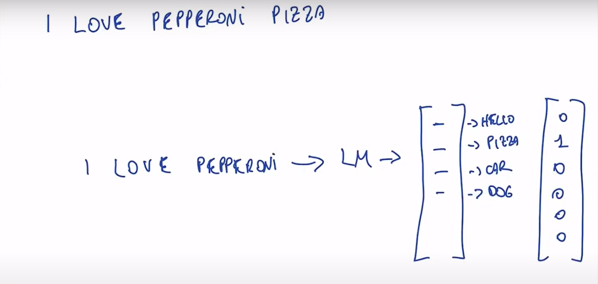

We use the same in contrastive learning.

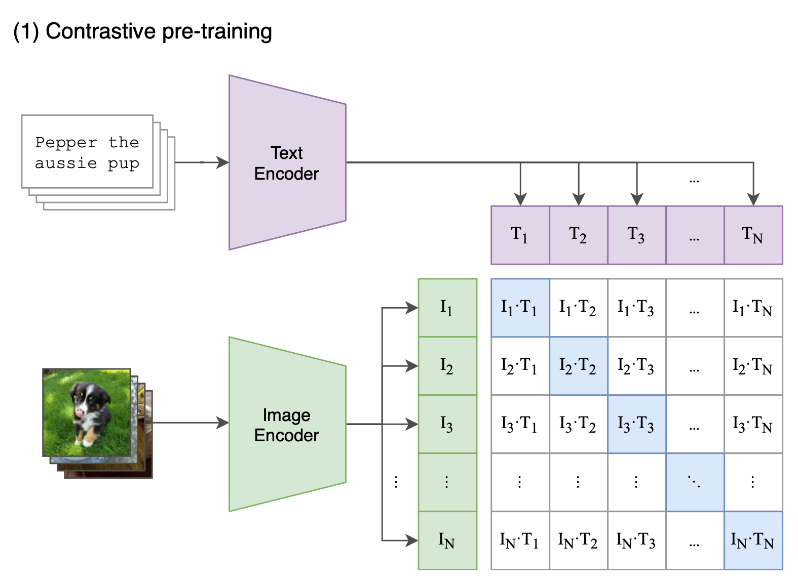

Here is the code for how to implement the CLIP training with contrastive loss.

```
# image_encoder - ResNet or Vision Transformer
# text_encoder - CBOW or Text Transformer
# I[n, h, w, c] - minibatch of aligned images
# T[n, 1] - minibatch of aligned text
# W_i[d_i, d_e] - learned proj of image to embed
# W_t[d_t, d_e] - learned proj of text to embed
# t - learned temperature parameter

# extract feature representations of each modality
I_f = image_encoder(I) #[n, d_i] #convert list of images into a list of embeddings
T_f = text_encoder(T) #[n, d_t] #convert list of prompts into a list of embeddings

# joint multimodal embedding [n, d_e]
I_e = l2_normalize(np.dot(I_f, W_i), axis=1)
T_e = l2_normalize(np.dot(T_f, W_t), axis=1) #make sure that both image and text embeddings have the same number of dimensions and normalize the vectors

# scaled pairwise cosine similarities [n, n]
logits = np.dot(I_e, T_e.T) * np.exp(t) #compute all the possible dot products

# symmetric loss function
labels = np.arrange(n)
loss_i = cross_entropy_loss(logits, labels, axis=0)
loss_t = cross_entropy_loss(logits, labels, axis=1)
loss = (loss_i + loss_t) / 2 # teach the model which item in each row/column needs to be maximized
```

## Problem with the CLIP model

How do we tell the model we want one item in each row/column to be maximized while minimizinf all other?

We use the Cross-Entropy-Loss!

## Numerical Stability of Softmax

The softmax function takes in vector as input and converts into a distribution, to be a distribution all the values must be non negative (>=0) i.e they are in range [0,1] and the sumation of all the values must be equal to 1.

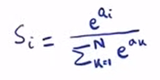 

We take the outputs of the model and then we exponentiate each item in the output vector and then we also divide it with the sum of all the other items which is also known as the **normalization constant**.

> [!WARNING]
> The exponentail is a function that grows very fast, so if the argument of the exponential grows then the exponential will be huge. This is a problem for the computers as we 
> store numbers using a fixed representation 16bit ot 32bit.

Solution :-> do not make the exp grow to infinity

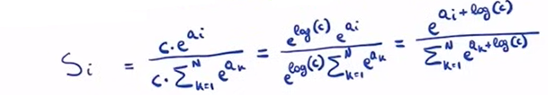

What we do is we multiply both the numerator and denominator with a constant **c**. We use log here as exp and log are inverse functions.

We normally choose 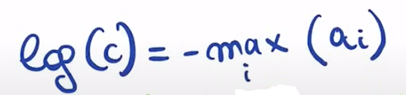 This will push the arguments of the exp towards negative numbers and the exp itself towards zero.

### The Normalization Factor in softmax

To calculate the normalization factor, we must fo through all the elements of each row and each column.

> [!NOTE]
> Due to the asymmetry of the softmax loss, the normalization is independently performed twot times: across images and across texts.
> 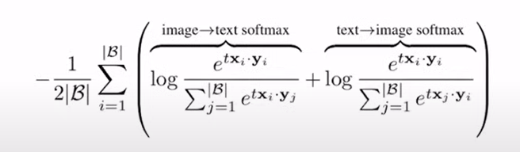

**Problem with CLIP model is that its computationally expensive to calculate this contranstive loss**

So as a solution in the SigLIP paper they mentioned to replace the **Cross-Entropy-Loss** with **Sigmoid-Loss**.

So in Sigmoid-Loss, we again have an Imgae encoder that converts a list of images into embeddings and Text encoder that converts a list of text into embeddings.

We then calculate all the possible dot products, and then instead of treating the loss as a distribution over row or column, we use it as a binary classification task. Each of this dot products is treated as independently from each other.

**This allows us to grow the batch size to millions of items and to parallelize this task**

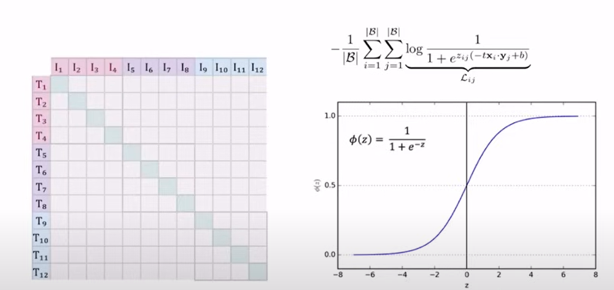 Here z is the dot product of the vectors.

## Why Contrastive Vision Encoder though and not any ordinary Vision Encoder?

We want the embeddings to capture the information about the image and be good representations that can be then contrasted and can be used along with text embeddings.

# Vision Transformer

A transformer model is a sequence to sequnce model, we feed it a sequence of embeddings and then it outputs a sequence of contextualize embeddings.

What we do is we take in an image, split it into patches or group of pixels. We then extract the information form the group of pixels with the help of Convolution and then we Flatten them meaning we loose the positional information and we just concatenate them with each other[we loose the 2dimentionality]. We then add this positional information which is **learned** and not calculated without any sinusoidal functions. We then feed it into the Transformer model which later on contextualises the embeddings through the attention mechanism to a series of embeddings, meaning it will not only capture the information about itself but also of the other patches/embeddings.

> [!NOTE]
> Text has a Auto regressive relationship meaning we write text from left to right, each word we write depends on what we have written previously and on the other hand Images 
> dont have a auto regressive relationship, in images the patches depends on all other patches to make the meaning of the particular image.

We use the contextualized embeddings to capture the information about the each patch and how its present in the image, meaning we want each patch to include the information about its position[positional encoding] and also whats surrounding this patch in image by contextualizing them.

This is how sequence to sequence model works with transformer models.

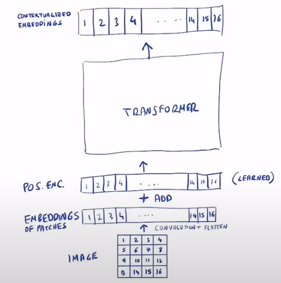

# Normalization

There are a list of linear layers and they are defined by two parameters **input-features** and **output-features** and one another term named **bias** which is a constant which is added to the product of features and **weigths** which are the values which determine the strength of the connections and they influence one neurons output on one neurons input. Usually we have a batch of items and each item is made up of features.

What we do is say we have one batch here, we multiply the input vector x with the weight and add some bias to it if its present and then it generates one output feature.

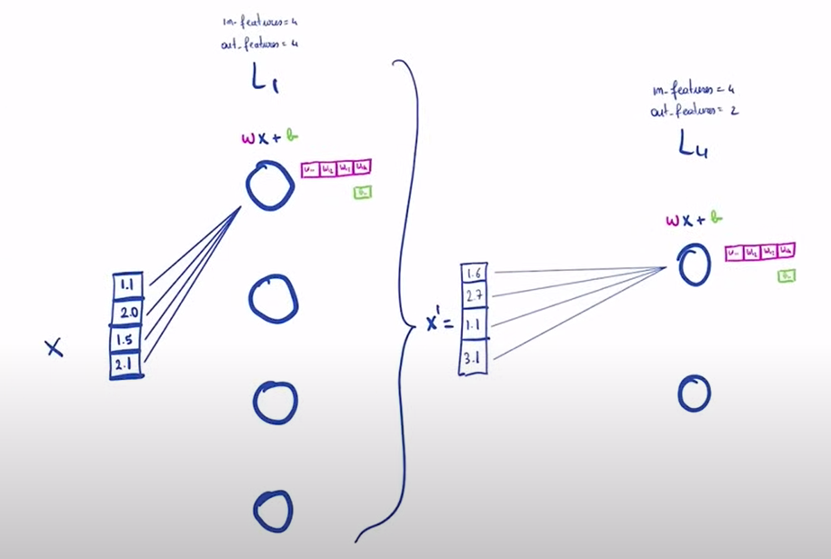

But there is one big problem here **Covariate Shift**

## Covariate Shift

When you have a input vector that changes from one batch to another in magnitude then the output of the layer will also change in magnitude depending on what is the incomming .

**Why is it bad?**

Big change in input of a layer -> Big change in outout of layer -> Big change in loss -> Big change in gradient -> Big change in the weights of the network -> therefore slow learning.

Solution-1 :-> Use **Batch Normalization**

We have a batch of items as input. for ex. we have a image classification task, we have as input a list of images and then features[dimensions that represent the particular image].

In Batch Normalization we calculate the statistics for each dimensions of each item[we calculate mean and varaince] and then we normalize each item by substracting mean and then dividing it by standard deviation. This will make each dimension of each item be distributed according to a gausian with mean 0 and a variance of 1.

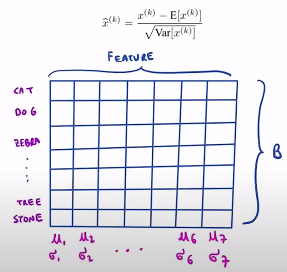

**Problem with Batch Normalization**

The problem with batch norm is that each statistics [mean and the varaince] are calculated along the batch dimension. The statistics depends on what other items are in the batch and therefore to get good results we must use a **big batch size**.

Solution 2 :-> **Layer Normalization**

We calculate the statistics along the item dimension instead of the batch dimension, but insted of the mean and standard deviation coming from the first dimention of each item it comes from the average of all the dimensions of the each item independently thus making the training more stable and even we are not forced to use the large batch size.

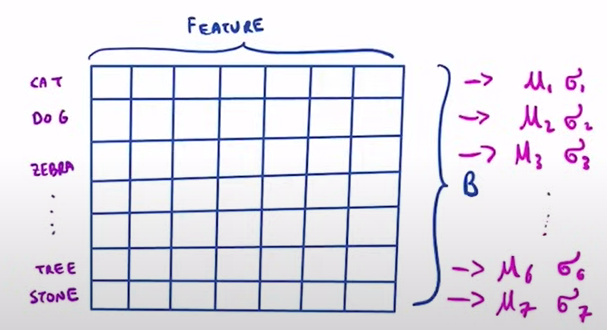 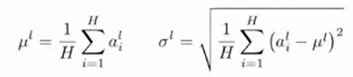 Here H is the no. of hidden units in a layer.

## Multi-Head Attention

It is a way of contextualizing stuff, you start with a seqeuence of patches. Say we have 4 patches, each of these patches is represented by a single vector of 1024 dimensions. Each of these patch is being extracted from a group of pixels from the image and it represents information about the image.

With multi head attention we contextualize these patches meaning the output of this is a tensor of the same size as of the input. Each of the patches in the output does not just catches information about itself but also about the other patches aswell.

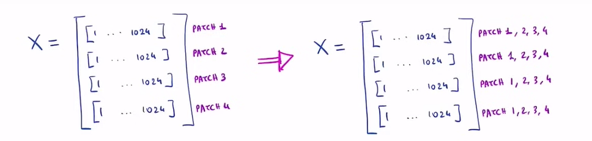

>[!NOTE]
> The above explainantion is for Vision transformer, for Language model we have am input sequence which is a sequence of tokens each representing one single word. Each token is representated as an embedding. We want to contextualize each token with all the tokens that come before it.
>
>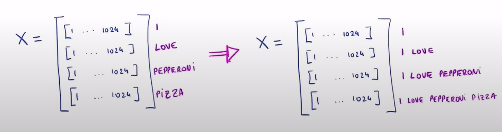
>
> In language models we basically train on the next token prediction, we start with some tokens which are the prompts and ask the model what would be the next token till the predicition task is finished and we receive the complete output.
>
> Predict next tokens given the past tokens and the transformer allows us to do that in parallel with training . We have uncontextualized inputs and a series of contextualized output, in such a way that each tokens captures information about itself and also about the previous token.
>
> The self attention model will take the prompt as input and generate the output in parallel using the multi head attention.
>
> We also need some labels to train the model.


**Step-1** Convert the input sequence X into Query, Key, Values

We convert them using 3 transformations W <sub>q </sup> , W <sub>k </sub> , W <sub>v </sub> , which is a matrix multiplication. 

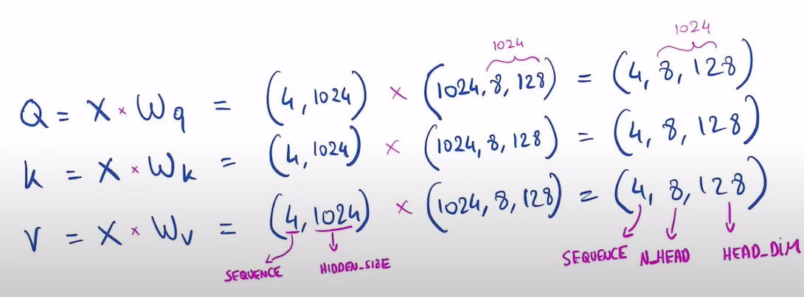

here sequence is the no. of tokens or patches, hidden_size represents the size of this embedding vector

the transformations are of size (1024,8,128) -> the second 1024 is divided into 8 groups of 128. The second matrix has 1024 rows with 8 invidual vectors and its made up of 128 dimensions. Therefore the resulting output is also split into multiple sub groups 4 rows, 8 vectors and 128 dimensions

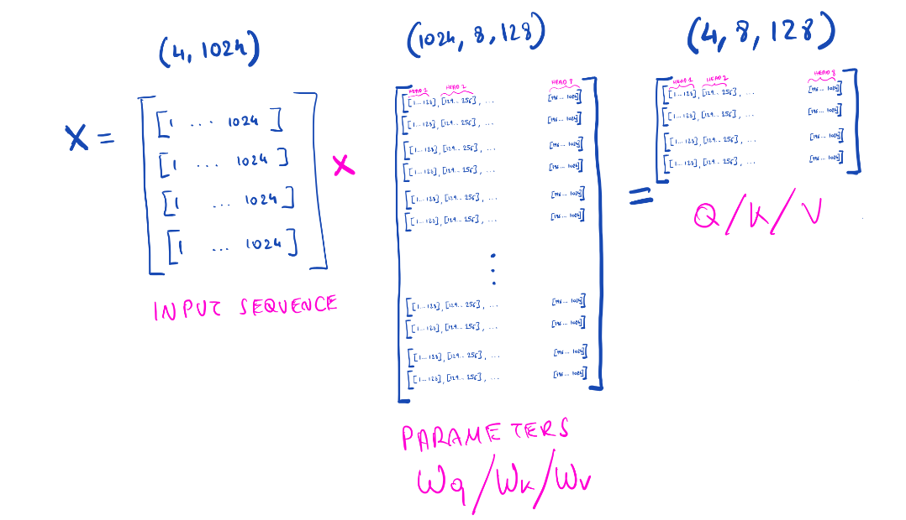

>[!NOTE]
> Multi head attntion is a way to relate tokens with each other, we dont want the tokens to relate by watching the full embedding of each token, we want to do it with the 8 individual heads such as each heads works with a smaller part of embedding of each token. 


We generally calculate the dot product over all the embedding of token, and we do this with token 1, 2 etc. therefore theres only one way to relate between tokens.

By spliting each token into smaller groups[heads] we releate the tokens differently. This multi head attention is based on dot products, this occurs in parallel. 


**Step-2** Treat Each Head Independently!

We want to compute the multi head attention in parallel, i.e each head should be able to visualize the entire sequence but smaller part of the embedding of each token.

We exchange the sequence dimension with the head dimension

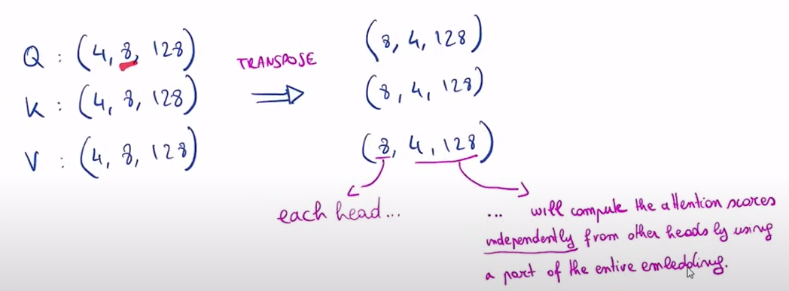

WHY Multi-head attention?
1. we want to parallelize the computation
2. each head should learn to relate tokens or patches differently 


**Step-3** Calculate the attention for each head in parallel

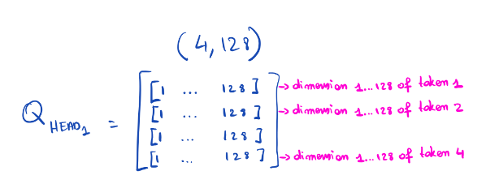 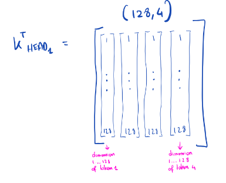

for each head is made up of a sequence of tokens, and each token is not the full embedding of the token but its the first 128(differs). we do a transpose here in which each of these row vectors become column vectors. we then multiply it and we get a matrix which represents the dot product of one token with another token i.e the relationship between the tokens the bigger the dot product the more intense is the relationship.

we have the sqrt of the model as denominator bcz we want the magnitude to be constant

>[!NOTE]
>In landuage model we add a attention mask, we donot want the first token to be related to other tokens as theres no previous tokens, similartly the token next to it wont be related to the next tokens but the previous ones and so on. The relations that u dont want can be replace with -∞. In the next step u have to apply the softmax which will convert each od these numbers into probability score. we apply softmax row by row.
>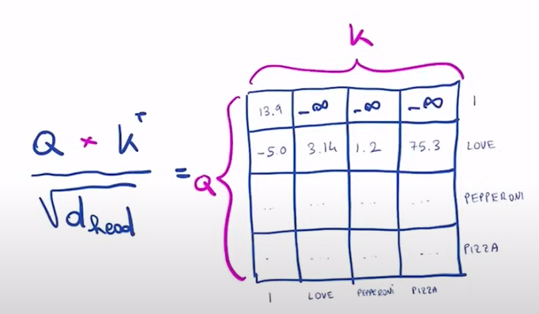

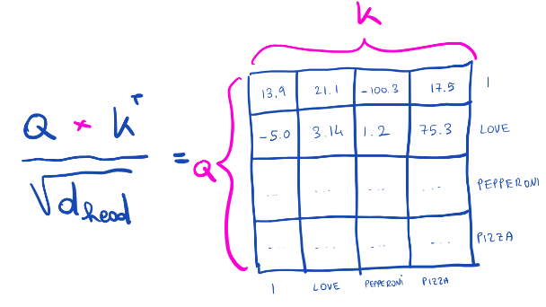

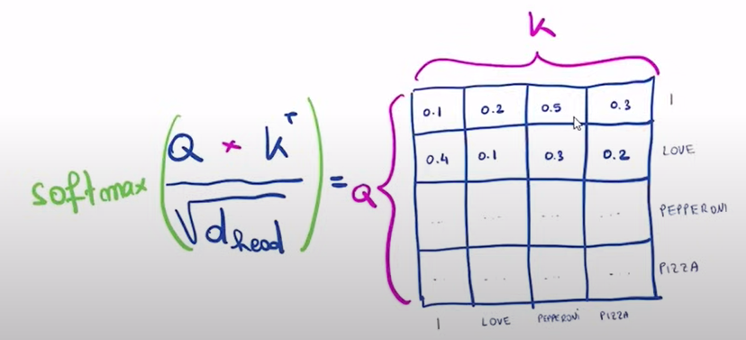

the prbabilities will range from 0-1 and we want the sumation of each rows to be 1

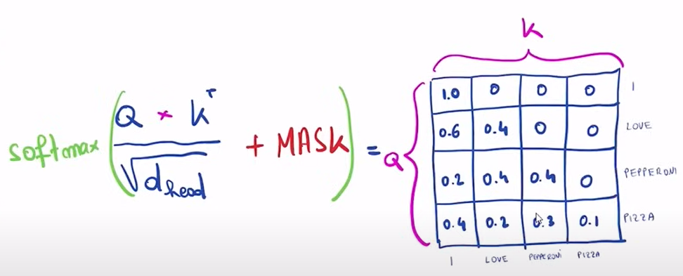

we will add the mask[the ones we dont want] before applying the softmax, it will replace all the interactions with 0 which we dont want. the resultant matrix is known as the **attention weight**[tells us how intense is the relation between two tokens]. 

>[!WARNING]
>This process will continue till the number of heads you have. Each of them is calculated in parallel

**Step-4** Multiply by the Value sequence

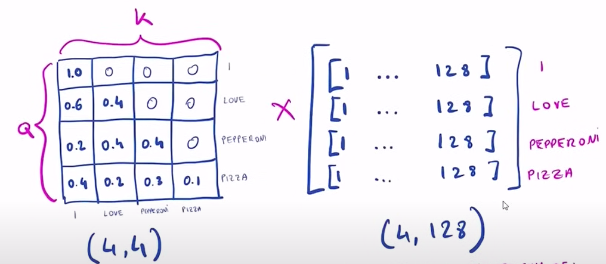

the attention weight matrix and the value sequence matrix will be multiplied. so the first row of the attention matrix will be multiplied with all the individual columns of the value sequence matrix. as we can see in the first row of attention matrix we only have value filled in the first key the rest will be 0 that means in the value sequence only the first token will contribute, this will continue row by row 

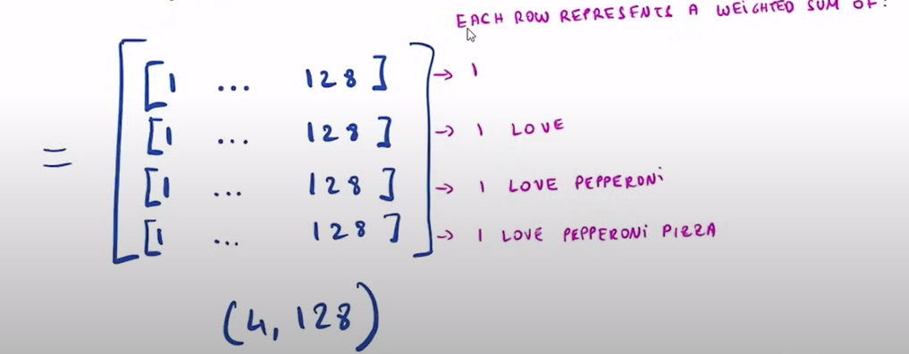

therefore generating contextualized embeddings part by part.

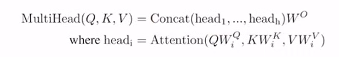

We merge all these heads by concatenating them.

**Step-5** Transpose Back

We have to swap the head dimension and the sequence dimensions

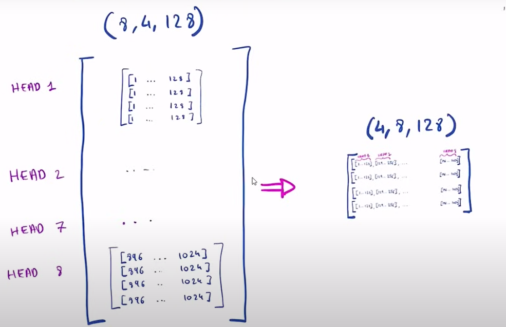

**Step-6** Concatenate All The Heads

Given that each head is computing the contextualized embeddings using a part of each token we can concatenate all the result of all the heads back together. Meaning all the heads in the first token will be concatenated.

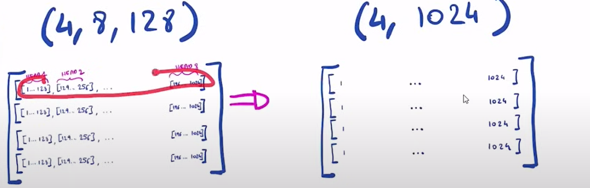

**Step-7** Multiply by W<sub>o</sub>

W<sub>o</sub> matrix is a (embedding_size,embedding_size) parameter.

so the first row of the concatenated matrix will be multiplied by the first column of the W<sub>o</sub> matrix, meaning 1024 dimensions of the first head, 1024 dimensions of the second head will all participate in the same dot product of the first column of the W<sub>o</sub> matrix giving up one single number in the resultant matrix so there has been a mixing of the results.

if we dont multiply with the W<sub>o</sub> matrix theres no mixing between the result of each head which happen independently in parallel.

**We dont want the each token to be a contextualized version of multiple sub tokens each calculated independently from each other by the multi head attention, we want that to happen in parallel and mix the result of this multi head attention and we do that by multiplying W<sub>o</sub> matrix.**

>[!NOTE]
>**WHY MULTIPLY BY W<sub>o</sub> MATRIX?**
>
>If we dont multiply by W<sub>o</sub>, each group of 128 dimensions will be independent from each other, as they are the result of the concatenation of independent heads. Multiplying by W<sub>o</sub> gives the chance to each head to **"mix"** with other heads.


## Weight Tying

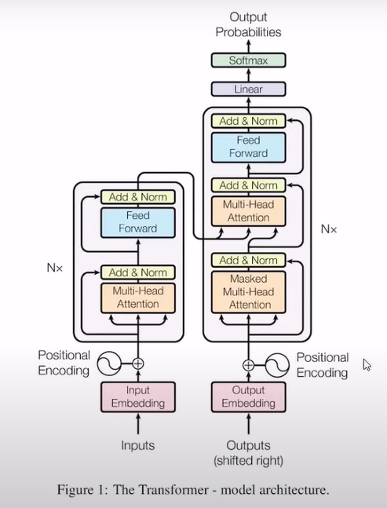

Weight Tying is a technique where you reuse the parameters of one layer into another. With weight tying it shares the parameters of one layer with another for example in the Decoder section of transformer the Output embedding layer and the Lienar layer do opposite tasks. Becasue of this technique you reduce the total number of parameters as you are sharing these parameters 


# KV-Cache

**The problem**

The transformer model is a sequence to sequence prediciton model. Given a prompt the transformer modle has to generate embeddings[contextualized -> capture information about itself and other tokens also], on the basis of that it should predict the next word[lable].

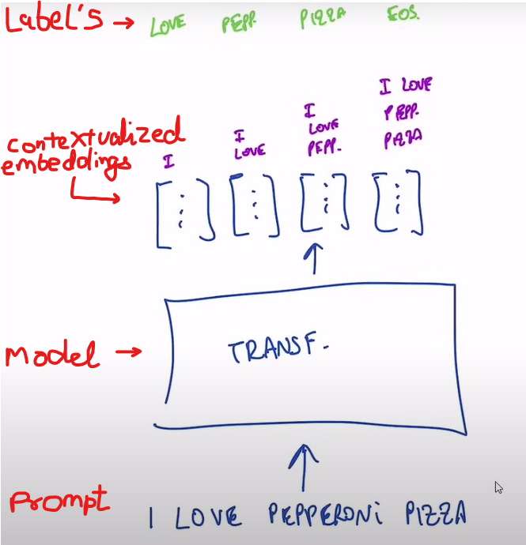

During inference the user only gives one token, we feed this into the transformer network, it will generate one contextualized embedding. We then project this embedding into **logits**, these logits tell us what score is assigned by the model to each token giving information about liklihood which token is the next one i.e a probablility score and then you apply **softmax** which all sum up to 1, we select the one with the highest value.

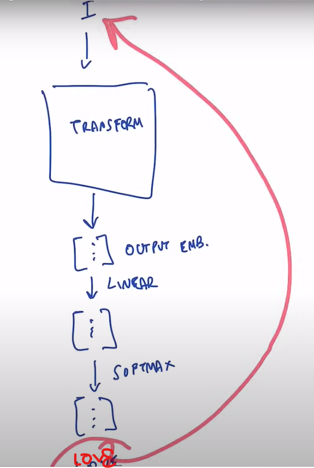

We then feed in the new token embedding into model resulting into two contexutalized embedding, we select the best contextual embedding and perform the same step.

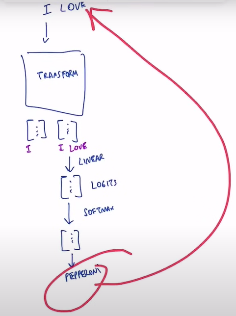

We keep doing this till the entire sentence is generated.

**Problem** -> In this sequence to sequence model we generate a lot of contextualized embeddings and are only using one embedding which is better at each inference step.


## KV-Cache

We start with one token, model will convert it into an embedding and feed it into transformer model. This single token will be converted into query, key, value. We have self attention[QxKxV matrix]. Then we project into logits apply softmax and then we move to the next token.

Whenever we pass a token into the model, we cache the key and value sequence into a buffer called K-V cache. Initially this is empty, after the second pass both the bufferes are populated.

We take the previously generated token and take it as input to the model and follow the process again. We append this new token into the K-V cache and use this buffer to perform the self-attention.

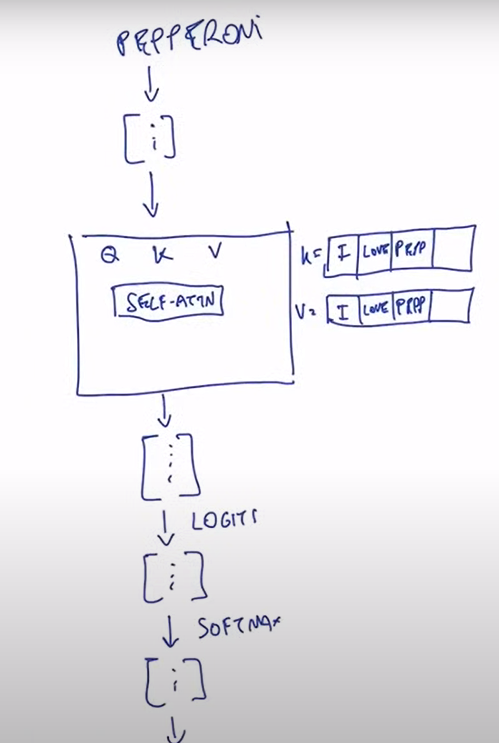

With this we can get rid of the unwanted tokens, but we dont want to add tokens one by one as it will be slow. Generally the prompt will not be short it will be long.

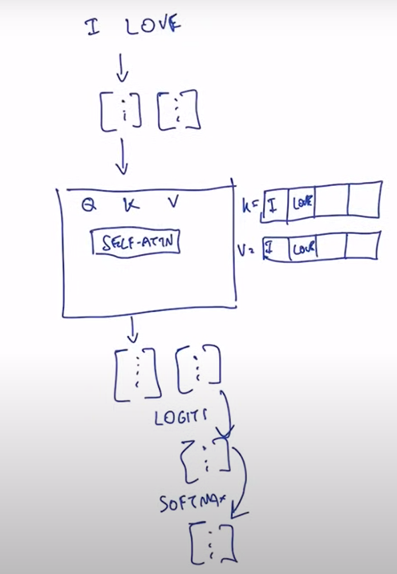

**Pre-Fill**
Say we have a prompt with two words, we create two embeddings and then pass it into the transformer model. Initially the kv cache is empty, the q,k,v sequence will have 2 tokens each, we put the k,v tokens in the resp buffers. We then calculate the self attention resulting into a 2x2 matrix, 2 output embeddings -> 2 logits embeddings -> 2 softmax and we will use only the last one as we dont want to predict the second word but the next one.

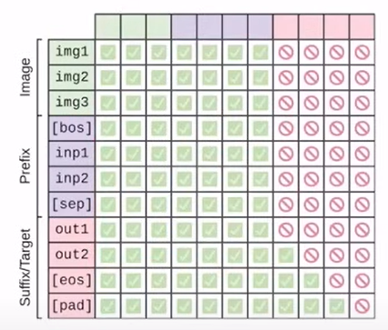

Prompt in paligemma is made up of image tokens, user prompt. The prompt is not causal because the textual prompt is generally very short and it describes what task the visual lang model has to perform.

During prefilling we would have text prompt and the image tokens, we dont have to generate any mask here because each text prompt can watch even future tokens of the text prompt. The prompt is not causal as we are not going to generate it, all we do is pass it to the model. So the input[**Prefix**] is not causal and the output[**Suffix/Target**] is causal.

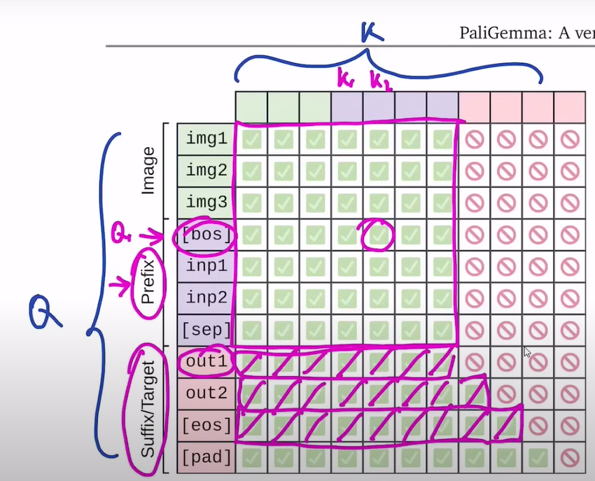

In suffix the first output needs to attend all the previous keys, so as per the above fig 3 image tokens and 4 text tokens, the next output needs to attend all the 3 image tokens, 4 text tokens plus the last generated token, and it continues till all the tokens are predicted.


## Gemma Architecture

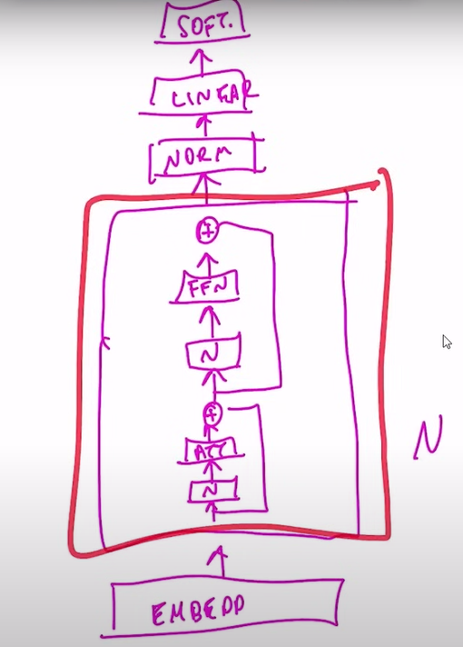

## RMSNorm[RootMeanSquare Norm]

Each item of the batch is normalized in such a way that they are coming out of a distribution[gaussion distribution] with a center of 0 and the variance 1.

LayerNorm was successfull because of **re-scaling** invariance instead of the **re-centering** invariance.

>[!NOTE]
>We use Normalization to reduce the internal co-varaite shift.

The model does not need to see the values centered arround 0, it just needs to see the values mostly surrounded on whatever mean they are centered upon.

RMSNorm is more advantageous as instead of calculating two statistics mean and variance, we only need to calculate one **root mean square**.

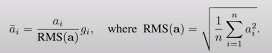

We take each item in this vector, we square it up, we sum them up, we then calculate the mean(divded by n), square root that gives us the RMS<sub>(a)</sub>. We then take each of the items divide it by RMS<sub>(a)</sub> and multiply it by g<sub>i</sub> which is a learnable parameter Gamma **which is 1 for each feature**.

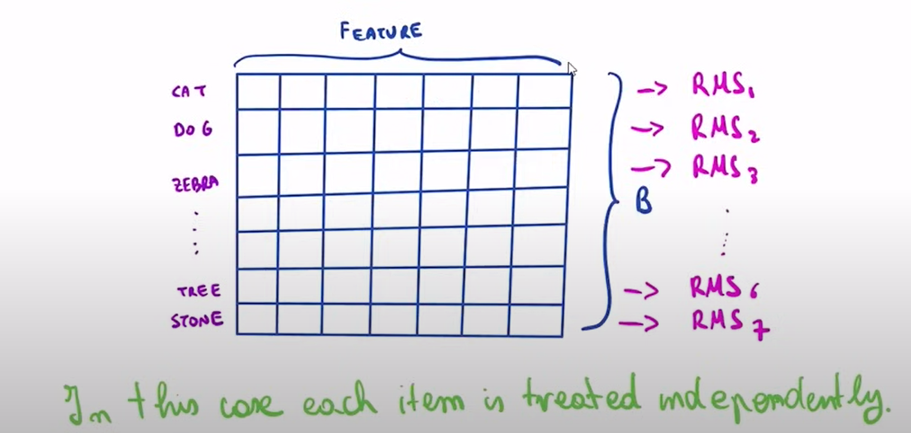


During the normal Multi-Head Attention, each token is divided into multiple groups of dimensions known as heads.
Lets say we have 1024 dimensions and we divide them in 8 heads, therefore each head will manage 128 dimensions of this token.

We will have a dot product with the Query and Key values, so dot product of the first query head with first key head, then the second key head and the third key head[will repeat till the no. of keys you have]. Then we move on to the second Query head and repeat the same till all the Query heads are covered.

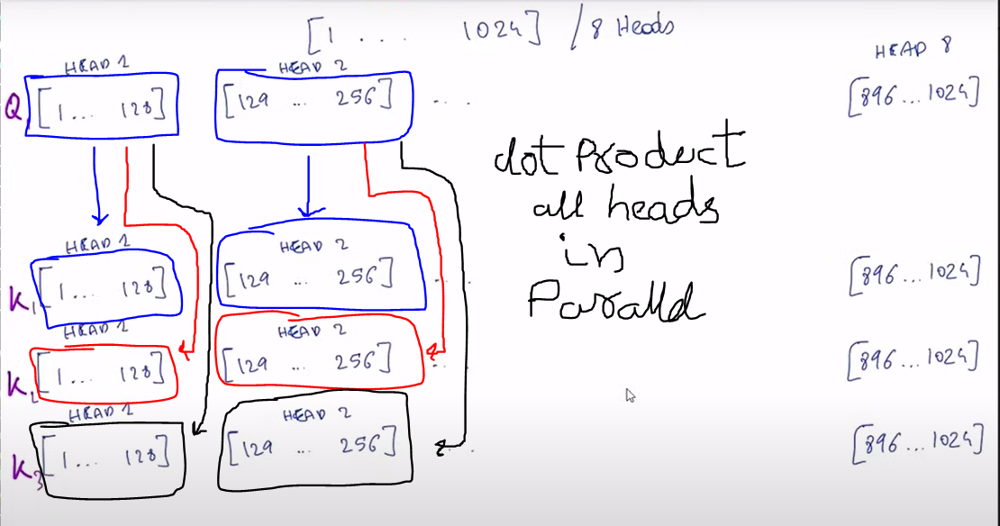

Theres a **problem** with Multi-Head attention though.

-> The problem is not with the number of number of computation we do[bottleneck] but the number of data transfered in the GPU.

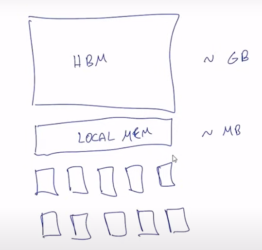

The GPU architecture consists of a HighBandwithMemory(~GB) then the LocalMemory(~MB) then multiple cores which all work in parallel. During matrix multiplciation in a GPU, the kernel that manages the multiplciation **CUDA-kernel**. Matrix to be multiplied is in HighBandwithMemory, we will copy the first part of the matrix from HBM to the LocalMemory and each core work with a part of this matrix to compute the multiplication in parallel.

During MultiHeadAttention the first head will copy be copied to the LocalMemory and then it will be accessed by the cores in GPU, this happens for every head in the query.

The bottleneck here is how much time it takes to copy the memory from the HighBandwithMemory to LocalMemory, although the gpu has faster Core's but its not capable to copy stuff faster.

So how to reduce the data trasnfers?

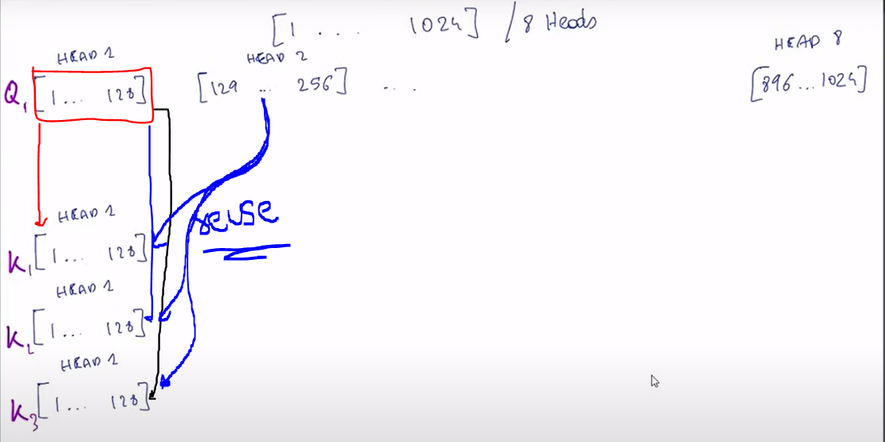

-> Use less heads for the keys. as per the above fig. the first core will copy the first head  of the query from HBM to LM and also the 128 dimensions of each tokens in the Keys, it will perform the computation, meanwhile the second core will copy the 128 dimensions of head 2 in the query from HBM to LM but they do not need to copy the next 128 dimensions of each keys. They can reuse/share the keys that had been earlier loaded into the LocalMemory. As per scenarios you can share 1 key head between 2 query heads it deffers.

>[!NOTE]
>Thats why in the GemmaAttention class we have less parameters in W<sub>k</sub> and W<sub>v</sub> to compress these tokens into smaller tokens.

>[!WARNING]
>The MultiQueryAttention reduces the quality of the model but its acceptable.

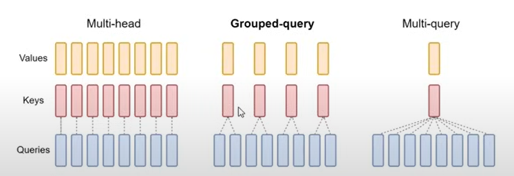

Grouped-Quey cache is a middle man between Multihead and Multiquery it provides better performance by reducing the quantity of data transfer, it also reduces the size of KV-Cache[as the tokens are compressed so the total amount of memory recquired for kv_cache also reduces].

**kv_cache** is a big bottleneck in the new huge language models but we still use it as we have to store each single token in each of the layer which goes very faster if there are lot of tokens[requirements].


### repeat_kv method from gemma.ipynb

We have projection W<sub>k</sub> and W<sub>v</sub> of the token that results into a smaller token, this gives us a benefit from the kv-cache.

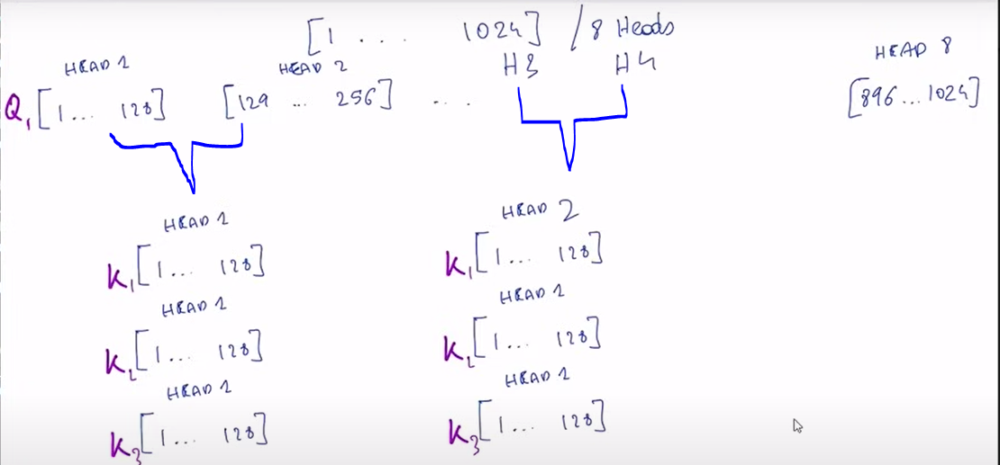

But to compute attention each query head needs to share the head with other query head when working with the keys.

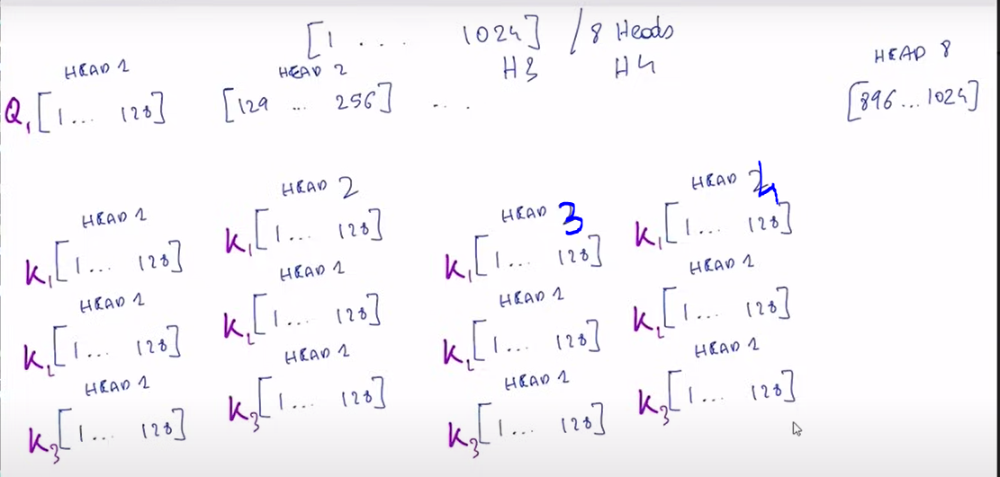

Because we are working with the naive implementation of the attention it does not really actually benefit from this optimization, so we repeat the missing heads so that each query has its own key head, this is bcz we are not creating a custom CUDA kernel for the computation of the attention and we repeat it such as the Group-Query attention never happened. 

## Rotary Positional Embedding


In the traditional models, we have our tokens which indicate the position of the token in the vocabulary we convert them into embeddings in the embedding layer and add some other vectors to this embeddings that encode the positions informations of each token and we use positional encoding for that purpose.  

>[!NOTE]
>In the original transformers paper they introduced sinusoidal positional encodings also known as **absolute-positional** encodings because they encode the absolute position inside each token.

Now a days the **Rotary Positional Encodings** are used, they are in the family of relative positional encodings. The idea behind Positional Encoddings is that we do not add them directly to the embedding of each token so that each token encodes the information of its position but they modify the attention mechanism in such a way that the attention mechanism takes into consideration the position of the the tokens to relate them differently based on the position.

The multihead attention uses the dot product to relate the tokens to each other. As per the paper, We have to find an ecoding of the embedding vectors of tokens such that when we do the dot product for the token f<sub>q</sub>, f<sub>k</sub> query and keys respectively and encodes the positonal information in x<sub>m</sub> for query and x<sub>n</sub> such that when we do the dot product the output of this will only depend on the embedding of 1st token [x<sub>m</sub>], embedding of 2nd token [x<sub>n</sub>] and the relative distance between them.

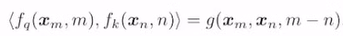

### A 2D case

embedding vector made up of only 2 dimensions.

We create a rotation matrix[sin and cos matrix], we are rotating this vector by some angle mθ. This will encode the information of the position based on the position m such that when we do the dot product of two vectors this dot product is guaranteed to be a fucntion of the embedding of the first vector, embedding of the second vector and the relative distance that was encoded into them.

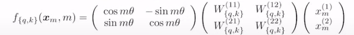


### General Case

for a d dimensional vector we have this rotation matrix which is a sparse matrix mostly made up of 0's, but here we would do many unnecessary computations as most of the elements are 0's

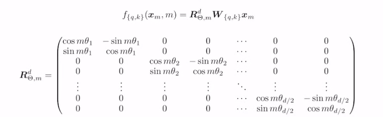

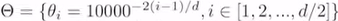

There is a better way to calucalte it. If you want to encode the position information inside of the embedding, you need to take the embedding[d-dimensional vector] multiply it element wise[each element] by another matrix which has the cosine where the argument of cosine is the multiple of the θ multiplied by the position of the token that we want to encode in this token [m] + dimensions of the vector rotated and with changed signs multiplied element wise with sin of the same arguments.

Rotary Positional Embedding has a decaying effect based on the distance between 2 tokens, i.e the dot product is converted into a score[softmax] which tells us how intense the relationship is[the bigger the dot product the more the token will contribute to the output].

The dot product will be high when two tokens are close and as they move the dot product will decay.

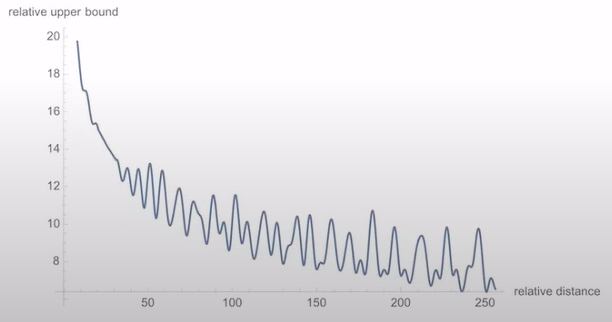

Each 2 dimensions are being rotated by the same angle, we have a token made up of many dimensions so each pair of dimensions is getting rotated like a 2d vector that is a multiple of the base angle with respect to the position encoding. 


>[!NOTE]
>
>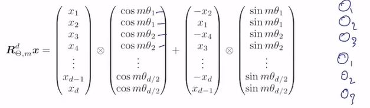
>
>In the code implementation instead of writing mθ<sub>1</sub>,mθ<sub>1</sub>,mθ<sub>2</sub>,mθ<sub>2</sub> we write mθ<sub>1</sub>,mθ<sub>2</sub>,mθ<sub>3</sub> and repeat them. So when for example the weights of llamma are converted to huggingface they permuted the projection[query and key] which is the embedding of the token and they do it permute again therefore countering the effect of the first permute.


# Top-P Sampling

**WAY-1**

Logits after you apply softmax corresponds to a distribution. Logits is a vector wehere the number of dimensions = vocabulary size and it indicates what the model thinks the next token should be. The softmax converts each of this numbers into a modality score(sum upto 1) and we take the highest to predict which token comes next.

**WAY-2**

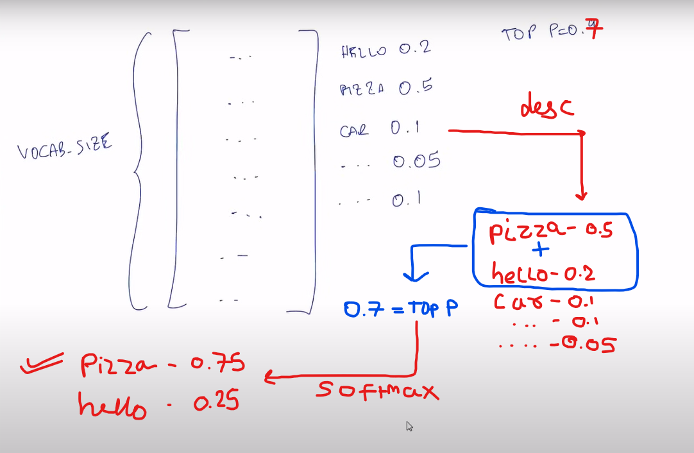

There is a list of numbers one for each position in the vocabulary, we can do sampling which means we can sort these numbers that we get in decreasing order and then we take the top ones that sum up to a probability score. We then rearrange the numbers again so that they sum up to 1 after applying softmax and then we sample again from this distribution.


# Temperature

When we apply the temperature we are basically we are making the difference between them a lil bit smaller, therefore we are introducing some noise. With temperature we are making it more likely to choose more diverse tokens as we are reducing the gaps between the probablity scores of the tokens.


>[!NOTE]
>In the end download the model from hugging face and run it